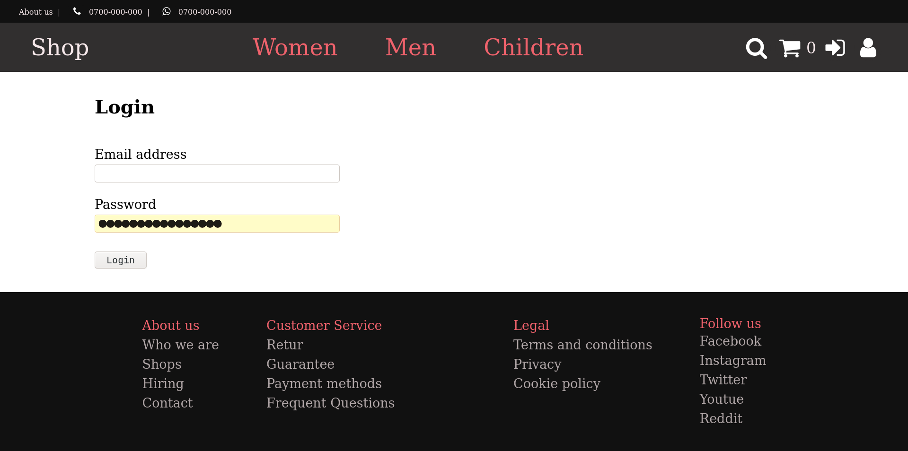

# Proiect Tehnici Web

Nume: Radu

Prenume: George-Mihai

Grupa: 144

---

Start the JSON server:

```js
json-server --watch data/products.json
```

I used nodemon in dev mode for convenience.

Start the Node.js server:

```js
npm start
```

## Site presentation

### Index page


### List products


### Register & Login




### The format of pages with info, can be found at the bottom of each page in footer


## TODO

- maybe in the future add more data for the site, and more utility to it like a
  shopping cart etc.
- add CRON for newsletter
- create template newsletter
- update images README

## Pictures

Credits to:

```
https://www.pexels.com/
```

## The video on the index page

Music provided by <http://spoti.fi/NCS>

Link on yt: <https://www.youtube.com/watch?v=3nQNiWdeH2Q>
